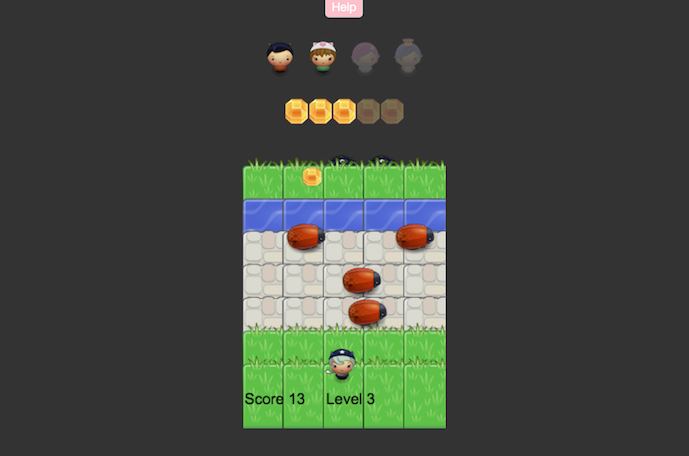

# Classic Arcade Game 
===============================

## The rules 
**The evil monster have hidden your friends and your mission is to save them! To win you have to get pass the enemies to collect the diamonds on the other side of the river.** 
 
- For each 5 diamonds, the monster give you one friend back. 
- For each friend you get back, you level up. 
- With each level up the bugs move faster. 

## How to run the game
1. You can find the files on my [GitHub](https://github.com/NatalieCyreus/frontend-nanodegree-arcade-game)
2. Open up the index.html with a browser. This will start the game in the browser. 
3. Read the instruction message that opens up before the game start. 
4. To remove the welcome message, click on the cross in the upper right corner of the modal, or click anywhere on the screen outside of the modal. 
5. Use the arrows to move the player on the canvas. 
6. When collission with a diamon you get one point and transfers back to start position. 
7. The diamond change position each time there's collision with a enemy bug or diamond.
8. If you collide with a emeny bug you get back to start position. 
9. For each 5 point you get a friend back and level up. Each level up makes the enemy bugs move faster.
10. To start the game over you refresh the browser page.   

## Code
There is 4 classes used for this program. The game is written with html canvas and js, theres also html5, jQuery, css and bootstrap to improve UX. 
#### 1. Score 
The score class write the score and level board to the canvas. The score and level increases with the `Player` class. 
#### 2. Enemy 
The `Enemy` class creates the enemies and sets their speed and position. The enemy objects are listed in an array.  
#### 3. Player 
The `Player` class creates the player and its position. The player class is used to check for collisions with the enemy objects and the gem. With collision with the gem the the score increases, and the level increases depending on the score. 
In the `checkWinnig` function the gem images also change color from gray to color. This is a effect made to visually show increase of points by changing the image using jQuery dom manipulation.   
#### 4. Gem
The `Gem` class use a function to get a random number so that the gem change position if either a enemy collision, or a gem collection occurs. 

   

